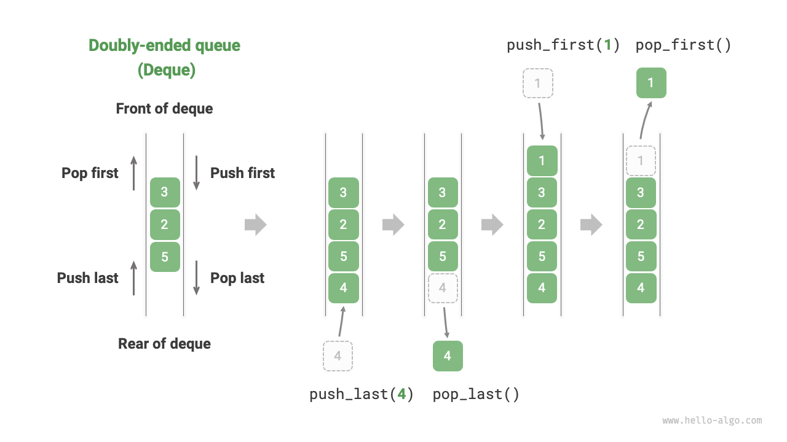

# 🚀 Deque in Java

## 🔍 What Is a Deque?
A **Deque (Double-Ended Queue)** allows elements to be added and removed from **both ends**—front and rear.

### ✅ Use Cases:
- Queue (FIFO)
- Stack (LIFO)

---

## 🧠 Visual Representation
  
*Source: [Hello Algo](https://www.hello-algo.com/en/chapter_stack_and_queue/deque/)*

---

## 🛠️ Deque Methods

### 🔹 Insertion
| Method | Description |
|--------|-------------|
| `addFirst(E e)` | Inserts element at the front |
| `addLast(E e)` | Inserts element at the rear |
| `offerFirst(E e)` | Inserts at front, returns `false` if full |
| `offerLast(E e)` | Inserts at rear, returns `false` if full |
| `push(E e)` | Stack-style insert at front |

---

### 🔹 Removal
| Method | Description |
|--------|-------------|
| `removeFirst()` | Removes and returns front element |
| `removeLast()` | Removes and returns rear element |
| `pollFirst()` | Removes front, returns `null` if empty |
| `pollLast()` | Removes rear, returns `null` if empty |
| `pop()` | Stack-style remove from front |

---

### 🔹 Peek
| Method | Description |
|--------|-------------|
| `peekFirst()` | Retrieves front without removing |
| `peekLast()` | Retrieves rear without removing |
| `getFirst()` | Retrieves front, throws exception if empty |
| `getLast()` | Retrieves rear, throws exception if empty |

---

### 🔹 Utility & Iteration
| Method | Description |
|--------|-------------|
| `iterator()` | Iterates from front to rear |
| `descendingIterator()` | Iterates from rear to front |
| `contains(Object o)` | Checks if element exists |
| `size()` | Returns number of elements |
| `clear()` | Removes all elements |

---

## 🧪 Java Code Example

```java
Deque<String> deque = new ArrayDeque<>();

deque.addFirst("Java");
deque.addLast("Spring");
deque.push("Concurrency");

System.out.println(deque); // [Concurrency, Java, Spring]

deque.removeFirst(); // Removes "Concurrency"
deque.removeLast();  // Removes "Spring"

System.out.println(deque); // [Java]
