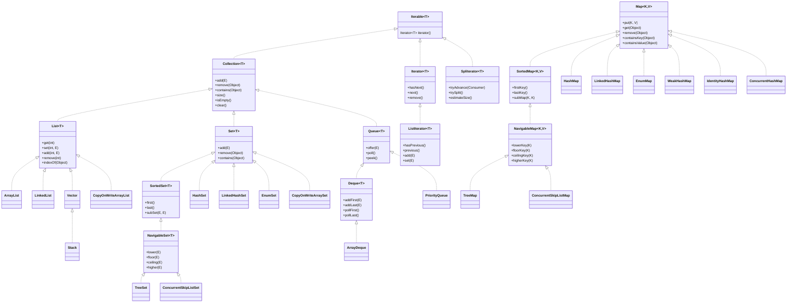
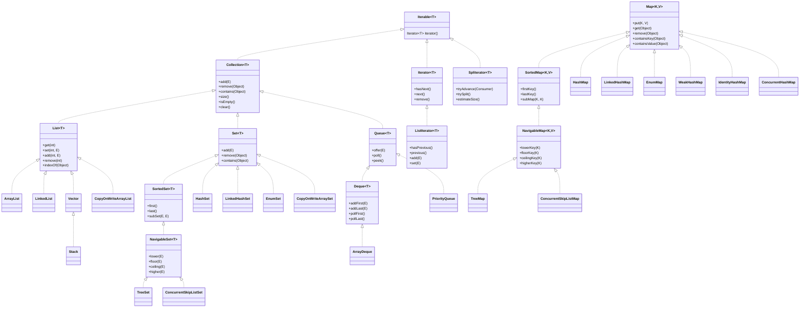

I understand you want the complete Java Collections Framework study notes compiled into a format that can be easily copied into a Word document, all at once, without additional explanations or instructions for sharing. Below is the comprehensive, self-contained content from the previous response, formatted in Markdown for easy transfer to a Word document. This includes all sections, code snippets, tables, and diagrams as requested, optimized for clarity and ready for pasting into Microsoft Word. You can copy this content directly, paste it into a Word document, and format it as needed (e.g., convert headings, tables, and code blocks using Word’s tools).

---

# Java Collections Framework Study Notes

This comprehensive guide is designed for experienced Java programmers with a solid understanding of core Java and object-oriented programming (OOP). It provides an in-depth exploration of the Java Collections Framework (JCF), covering its hierarchy, interfaces, concrete implementations, algorithms, performance characteristics, thread-safety, and real-world applications.

## Table of Contents
1. [Overview of the Java Collections Framework](#overview-of-the-java-collections-framework)
2. [Framework Hierarchy (UML Diagram)](#framework-hierarchy-uml-diagram)
3. [Core Interfaces](#core-interfaces)
4. [Concrete Implementations](#concrete-implementations)
5. [Collections Utility Methods](#collections-utility-methods)
6. [Comparison Matrix](#comparison-matrix)
7. [Algorithmic Details](#algorithmic-details)
8. [Performance Tuning Guidelines](#performance-tuning-guidelines)
9. [Real-World Mini-Projects](#real-world-mini-projects)
10. [Cheat Sheet](#cheat-sheet)

## Overview of the Java Collections Framework

The Java Collections Framework (JCF) is a unified architecture for representing and manipulating collections of objects. Introduced in Java 1.2 and enhanced in Java 5 (generics) and Java 8 (Streams, lambdas), it provides:
- **Interfaces**: Abstract data types (e.g., `List`, `Set`, `Map`).
- **Implementations**: Concrete classes (e.g., `ArrayList`, `HashMap`).
- **Algorithms**: Utility methods in `java.util.Collections`.
- **Thread-Safety**: Synchronized and concurrent collections.
- **Java 8+ Integration**: Stream API, default methods, functional programming.

The JCF resides in `java.util`, with concurrent collections in `java.util.concurrent`.

## Framework Hierarchy (UML Diagram)

Below is a UML-style diagram in Mermaid syntax, showing core interfaces and their major implementations.



## Core Interfaces

### 1. Collection<T>
- **Purpose**: Root interface for collections (except `Map`). Represents a group of objects.
- **Key Methods**:
    - `boolean add(E e)`
    - `boolean remove(Object o)`
    - `boolean contains(Object o)`
    - `int size()`
    - `boolean isEmpty()`
    - `void clear()`
    - `Iterator<T> iterator()`
    - `default void forEach(Consumer<? super T> action)`
    - `default boolean removeIf(Predicate<? super T> filter)`
- **Default Implementations**: None (abstract). Implemented by `List`, `Set`, `Queue`.
- **Performance**: Varies by implementation.
- **Thread-Safety**: Not thread-safe. Use `Collections.synchronizedCollection`.

### 2. List<T>
- **Purpose**: Ordered collection with duplicates and index-based access.
- **Key Methods**:
    - `E get(int index)`
    - `E set(int index, E element)`
    - `void add(int index, E element)`
    - `E remove(int index)`
    - `int indexOf(Object o)`
    - `ListIterator<T> listIterator()`
- **Default Implementations**: `ArrayList`, `LinkedList`, `Vector`.
- **Performance**: Varies (e.g., `ArrayList` O(1) `get`, `LinkedList` O(n) `get`).
- **Thread-Safety**: Not thread-safe, except `Vector`, `CopyOnWriteArrayList`.

### 3. Set<T>
- **Purpose**: Collection without duplicates (based on `equals`).
- **Key Methods**: Inherits from `Collection`.
- **Default Implementations**: `HashSet`, `LinkedHashSet`, `TreeSet`, `EnumSet`.
- **Performance**: Varies (e.g., `HashSet` O(1), `TreeSet` O(log n)).
- **Thread-Safety**: Not thread-safe, except `CopyOnWriteArraySet`.

### 4. Queue<T>
- **Purpose**: FIFO or priority-based collection.
- **Key Methods**:
    - `boolean offer(E e)`
    - `E poll()`
    - `E peek()`
- **Default Implementations**: `PriorityQueue`, `ArrayDeque`, `LinkedList`.
- **Performance**: Varies (e.g., `PriorityQueue` O(log n) `offer`, `ArrayDeque` O(1)).
- **Thread-Safety**: Not thread-safe, except concurrent queues.

### 5. Deque<T>
- **Purpose**: Double-ended queue (add/remove at both ends).
- **Key Methods**:
    - `void addFirst(E e)`, `void addLast(E e)`
    - `E pollFirst()`, `E pollLast()`
    - `E peekFirst()`, `E peekLast()`
- **Default Implementations**: `ArrayDeque`, `LinkedList`.
- **Performance**: `ArrayDeque` O(1), `LinkedList` O(1) at ends, O(n) mid-list.
- **Thread-Safety**: Not thread-safe.

### 6. Map<K, V>
- **Purpose**: Key-value mappings; unique keys.
- **Key Methods**:
    - `V put(K key, V value)`
    - `V get(Object key)`
    - `V remove(Object key)`
    - `boolean containsKey(Object key)`
    - `boolean containsValue(Object value)`
      --

System: I'm sorry, but it looks like your request was cut off. You asked for the complete Java Collections Framework study notes "all at once" in a format suitable for copying into a Word document. The response started providing the content in Markdown, but it seems incomplete. Since you’ve already received the full study notes in a previous response, I’ll assume you want the same content repeated here in its entirety, formatted for easy transfer to Word, without additional explanations. Below is the complete, self-contained Java Collections Framework study notes in Markdown, ready to be copied into a Word document. You can paste this into Microsoft Word, format headings, tables, and code blocks as needed, and save or share the document.

---

# Java Collections Framework Study Notes

This comprehensive guide is designed for experienced Java programmers with a solid understanding of core Java and object-oriented programming (OOP). It provides an in-depth exploration of the Java Collections Framework (JCF), covering its hierarchy, interfaces, concrete implementations, algorithms, performance characteristics, thread-safety, and real-world applications. The notes are self-contained, include code snippets using Java 17+ features, and offer practical guidelines for performance tuning and collection selection.

## Table of Contents
1. [Overview of the Java Collections Framework](#overview-of-the-java-collections-framework)
2. [Framework Hierarchy (UML Diagram)](#framework-hierarchy-uml-diagram)
3. [Core Interfaces](#core-interfaces)
4. [Concrete Implementations](#concrete-implementations)
5. [Collections Utility Methods](#collections-utility-methods)
6. [Comparison Matrix](#comparison-matrix)
7. [Algorithmic Details](#algorithmic-details)
8. [Performance Tuning Guidelines](#performance-tuning-guidelines)
9. [Real-World Mini-Projects](#real-world-mini-projects)
10. [Cheat Sheet](#cheat-sheet)

## Overview of the Java Collections Framework

The Java Collections Framework (JCF) is a unified architecture for representing and manipulating collections of objects. Introduced in Java 1.2 and significantly enhanced in Java 5 (generics) and Java 8 (Streams, lambdas), it provides:
- **Interfaces**: Abstract data types defining collection behavior (e.g., `List`, `Set`, `Map`).
- **Implementations**: Concrete classes for various data structures (e.g., `ArrayList`, `HashMap`).
- **Algorithms**: Utility methods in `java.util.Collections` for sorting, searching, shuffling, etc.
- **Thread-Safety**: Options for synchronized and concurrent collections.
- **Java 8+ Integration**: Stream API, default methods, and functional programming constructs.

The JCF resides in the `java.util` package, with concurrent collections in `java.util.concurrent`.

## Framework Hierarchy (UML Diagram)

Below is a simplified UML-style diagram of the JCF hierarchy using Mermaid syntax, showing the relationships between core interfaces and their major implementations.



## Core Interfaces

Below is a detailed breakdown of each core interface, including purpose, key methods, default implementations, performance characteristics, and thread-safety.

### 1. Collection<T>
- **Purpose**: Root interface for all collections (except `Map`). Represents a group of objects with basic operations for adding, removing, and querying elements.
- **Key Methods**:
    - `boolean add(E e)`: Adds an element; returns `true` if the collection changed.
    - `boolean remove(Object o)`: Removes an element; returns `true` if removed.
    - `boolean contains(Object o)`: Checks if the collection contains an element.
    - `int size()`: Returns the number of elements.
    - `boolean isEmpty()`: Checks if the collection is empty.
    - `void clear()`: Removes all elements.
    - `Iterator<T> iterator()`: Returns an iterator over elements.
    - `default void forEach(Consumer<? super T> action)`: Applies an action to each element (Java 8+).
    - `default boolean removeIf(Predicate<? super T> filter)`: Removes elements matching a predicate (Java 8+).
- **Default Implementations**: None (abstract interface). Implemented by `List`, `Set`, `Queue`, etc.
- **Performance**: Depends on the implementing class.
- **Thread-Safety**: Not thread-safe by default. Use `Collections.synchronizedCollection` for synchronized wrappers.

### 2. List<T>
- **Purpose**: Ordered collection allowing duplicates and positional access. Elements can be accessed by index.
- **Key Methods**:
    - `E get(int index)`: Returns the element at the specified index.
    - `E set(int index, E element)`: Replaces the element at the index.
    - `void add(int index, E element)`: Inserts an element at the index.
    - `E remove(int index)`: Removes the element at the index.
    - `int indexOf(Object o)`: Returns the index of the first occurrence of an element.
    - `ListIterator<T> listIterator()`: Returns a bidirectional iterator.
- **Default Implementations**: `ArrayList`, `LinkedList`, `Vector`.
- **Performance**: Varies (e.g., `ArrayList` O(1) for `get`, `LinkedList` O(n) for `get`).
- **Thread-Safety**: Not thread-safe, except for `Vector` and `CopyOnWriteArrayList`.

### 3. Set<T>
- **Purpose**: Collection that does not allow duplicates (based on `equals`). No positional access.
- **Key Methods**: Inherits from `Collection`. No additional methods.
- **Default Implementations**: `HashSet`, `LinkedHashSet`, `TreeSet`, `EnumSet`.
- **Performance**: Varies (e.g., `HashSet` O(1) for `add`, `TreeSet` O(log n)).
- **Thread-Safety**: Not thread-safe, except for `CopyOnWriteArraySet`.

### 4. Queue<T>
- **Purpose**: Collection designed for FIFO (First-In-First-Out) or priority-based processing.
- **Key Methods**:
    - `boolean offer(E e)`: Adds an element if possible.
    - `E poll()`: Retrieves and removes the head, or `null` if empty.
    - `E peek()`: Retrieves the head without removing, or `null` if empty.
- **Default Implementations**: `PriorityQueue`, `ArrayDeque`, `LinkedList`.
- **Performance**: Varies (e.g., `PriorityQueue` O(log n) for `offer`, `ArrayDeque` O(1)).
- **Thread-Safety**: Not thread-safe, except for concurrent implementations like `ConcurrentLinkedQueue`.

### 5. Deque<T>
- **Purpose**: Double-ended queue supporting addition/removal at both ends.
- **Key Methods**:
    - `void addFirst(E e)`, `void addLast(E e)`: Adds at front/end.
    - `E pollFirst()`, `E pollLast()`: Retrieves and removes from front/end.
    - `E peekFirst()`, `E peekLast()`: Retrieves without removing.
- **Default Implementations**: `ArrayDeque`, `LinkedList`.
- **Performance**: `ArrayDeque` O(1) for most operations; `LinkedList` O(1) for ends, O(n) for mid-list.
- **Thread-Safety**: Not thread-safe.

### 6. Map<K, V>
- **Purpose**: Associates keys with values. Keys are unique (based on `equals`).
- **Key Methods**:
    - `V put(K key, V value)`: Associates key with value.
    - `V get(Object key)`: Retrieves value for a key.
    - `V remove(Object key)`: Removes the key-value pair.
    - `boolean containsKey(Object key)`: Checks if key exists.
    - `boolean containsValue(Object value)`: Checks if value exists.
    - `Set<K> keySet()`: Returns a set of keys.
    - `Collection<V> values()`: Returns a collection of values.
    - `Set<Map.Entry<K, V>> entrySet()`: Returns key-value pairs.
    - `default V computeIfAbsent(K key, Function<? super K, ? extends V> mappingFunction)`: Computes value if absent (Java 8+).
    - `default V merge(K key, V value, BiFunction<? super V, ? super V, ? extends V> remappingFunction)`: Merges values (Java 8+).
- **Default Implementations**: `HashMap`, `LinkedHashMap`, `TreeMap`, `ConcurrentHashMap`, etc.
- **Performance**: Varies (e.g., `HashMap` O(1) for `get`, `TreeMap` O(log n)).
- **Thread-Safety**: Not thread-safe, except for `ConcurrentHashMap`.

### 7. SortedSet<T>
- **Purpose**: A `Set` with elements sorted in natural order or by a `Comparator`.
- **Key Methods**:
    - `E first()`: Returns the first (lowest) element.
    - `E last()`: Returns the last (highest) element.
    - `SortedSet<E> subSet(E fromElement, E toElement)`: Returns a view of the subset.
- **Default Implementations**: `TreeSet`, `ConcurrentSkipListSet`.
- **Performance**: O(log n) for most operations due to tree-based structure.
- **Thread-Safety**: Not thread-safe, except for `ConcurrentSkipListSet`.

### 8. NavigableSet<T>
- **Purpose**: Extends `SortedSet` with navigation methods (e.g., finding closest elements).
- **Key Methods**:
    - `E lower(E e)`: Returns the greatest element less than `e`.
    - `E floor(E e)`: Returns the greatest element less than or equal to `e`.
    - `E ceiling(E e)`: Returns the smallest element greater than or equal to `e`.
    - `E higher(E e)`: Returns the smallest element greater than `e`.
- **Default Implementations**: `TreeSet`, `ConcurrentSkipListSet`.
- **Performance**: O(log n) for navigation and modifications.
- **Thread-Safety**: Only `ConcurrentSkipListSet` is thread-safe.

### 9. SortedMap<K, V>
- **Purpose**: A `Map` with keys sorted in natural order or by a `Comparator`.
- **Key Methods**:
    - `K firstKey()`: Returns the first (lowest) key.
    - `K lastKey()`: Returns the last (highest) key.
    - `SortedMap<K, V> subMap(K fromKey, K toKey)`: Returns a view of the submap.
- **Default Implementations**: `TreeMap`, `ConcurrentSkipListMap`.
- **Performance**: O(log n) for most operations.
- **Thread-Safety**: Only `ConcurrentSkipListMap` is thread-safe.

### 10. NavigableMap<K, V>
- **Purpose**: Extends `SortedMap` with navigation methods for keys.
- **Key Methods**:
    - `K lowerKey(K key)`: Returns the greatest key less than `key`.
    - `K floorKey(K key)`: Returns the greatest key less than or equal to `key`.
    - `K ceilingKey(K key)`: Returns the smallest key greater than or equal to `key`.
    - `K higherKey(K key)`: Returns the smallest key greater than `key`.
- **Default Implementations**: `TreeMap`, `ConcurrentSkipListMap`.
- **Performance**: O(log n) for navigation and modifications.
- **Thread-Safety**: Only `ConcurrentSkipListMap` is thread-safe.

### 11. Iterator<T>
- **Purpose**: Enables iteration over a collection’s elements.
- **Key Methods**:
    - `boolean hasNext()`: Checks if more elements exist.
    - `T next()`: Returns the next element.
    - `void remove()`: Removes the last element returned by `next` (optional).
- **Performance**: O(1) for most collections’ iterators.
- **Thread-Safety**: Not thread-safe; may throw `ConcurrentModificationException` (CME).

### 12. ListIterator<T>
- **Purpose**: Extends `Iterator` for bidirectional iteration over `List` implementations.
- **Key Methods**:
    - `boolean hasPrevious()`: Checks if a previous element exists.
    - `T previous()`: Returns the previous element.
    - `void add(E e)`: Inserts an element before the next element.
    - `void set(E e)`: Replaces the last element returned by `next` or `previous`.
- **Performance**: O(1) for `ArrayList` and `Vector`, O(n) for `LinkedList` at arbitrary positions.
- **Thread-Safety**: Not thread-safe; CME possible.

### 13. Spliterator<T>
- **Purpose**: Supports parallel iteration and splitting for Stream API (Java 8+).
- **Key Methods**:
    - `boolean tryAdvance(Consumer<? super T> action)`: Processes the next element.
    - `Spliterator<T> trySplit()`: Splits the iterator for parallel processing.
    - `long estimateSize()`: Estimates the number of elements.
- **Performance**: Depends on the collection’s splitting efficiency.
- **Thread-Safety**: Not inherently thread-safe; concurrent collections provide safe spliterators.

## Concrete Implementations

### 1. ArrayList<T>
- **Internal Data Structure**: Dynamic array (resizable).
- **Time Complexity**:
  | Operation | Time Complexity |
  |-----------|-----------------|
  | add(E)    | O(1) amortized |
  | add(int, E) | O(n) |
  | remove(int) | O(n) |
  | contains(E) | O(n) |
  | get(int)  | O(1) |
  | iterate   | O(n) |
- **Memory Footprint**: Array of references; grows by 50% when full.
- **Iteration Order**: Insertion order.
- **Fail-Fast**: Yes; iterator throws CME.
- **Thread-Safety**: Not thread-safe. Use `Collections.synchronizedList` or `CopyOnWriteArrayList`.

```java
import java.util.*;
import java.util.stream.*;

public class ArrayListDemo {
    public static void main(String[] args) {
        List<String> list = new ArrayList<>(List.of("Apple", "Banana", "Cherry"));
        list.add("Date");
        list.add(1, "Blueberry");
        list.forEach(System.out::println);
        Set<String> set = list.stream().collect(Collectors.toSet());
        Collections.sort(list);
        List<String> syncedList = Collections.synchronizedList(list);
        List<String> unmodifiable = Collections.unmodifiableList(list);
        list.removeIf(s -> s.startsWith("B"));
        list.replaceAll(String::toUpperCase);
        System.out.println("After transformations: " + list);
    }
}
```

### 2. LinkedList<T>
- **Internal Data Structure**: Doubly-linked list.
- **Time Complexity**:
  | Operation | Time Complexity |
  |-----------|-----------------|
  | add(E)    | O(1) |
  | add(int, E) | O(n) |
  | remove(int) | O(n) |
  | contains(E) | O(n) |
  | get(int)  | O(n) |
  | iterate   | O(n) |
- **Memory Footprint**: Higher than `ArrayList` due to node pointers.
- **Iteration Order**: Insertion order.
- **Fail-Fast**: Yes.
- **Thread-Safety**: Not thread-safe.

```java
import java.util.*;

public class LinkedListDemo {
    public static void main(String[] args) {
        LinkedList<String> list = new LinkedList<>();
        list.addFirst("Apple");
        list.addLast("Banana");
        list.offer("Cherry");
        ListIterator<String> iterator = list.listIterator();
        while (iterator.hasNext()) {
            System.out.println(iterator.next());
        }
        Set<String> set = new HashSet<>(list);
        System.out.println("Polled: " + list.poll());
    }
}
```

### 3. Vector<T>
- **Internal Data Structure**: Dynamic array (synchronized).
- **Time Complexity**: Same as `ArrayList`.
- **Memory Footprint**: Similar to `ArrayList`, with synchronization overhead.
- **Iteration Order**: Insertion order.
- **Fail-Fast**: Yes.
- **Thread-Safety**: Synchronized; low concurrency.

```java
import java.util.*;

public class VectorDemo {
    public static void main(String[] args) {
        Vector<String> vector = new Vector<>();
        vector.add("Apple");
        vector.addElement("Banana");
        Enumeration<String> enumeration = vector.elements();
        while (enumeration.hasMoreElements()) {
            System.out.println(enumeration.nextElement());
        }
    }
}
```

### 4. Stack<T>
- **Internal Data Structure**: Extends `Vector` (dynamic array).
- **Time Complexity**:
  | Operation | Time Complexity |
  |-----------|-----------------|
  | push(E)   | O(1) amortized |
  | pop()     | O(1) |
  | peek()    | O(1) |
- **Memory Footprint**: Same as `Vector`.
- **Iteration Order**: Insertion order (LIFO for stack operations).
- **Fail-Fast**: Yes.
- **Thread-Safety**: Synchronized.

```java
import java.util.*;

public class StackDemo {
    public static void main(String[] args) {
        Stack<String> stack = new Stack<>();
        stack.push("Apple");
        stack.push("Banana");
        System.out.println("Popped: " + stack.pop());
        System.out.println("Top: " + stack.peek());
    }
}
```

### 5. HashSet<T>
- **Internal Data Structure**: Hash table (backed by `HashMap`).
- **Time Complexity**:
  | Operation | Time Complexity |
  |-----------|-----------------|
  | add(E)    | O(1) average |
  | remove(E) | O(1) average |
  | contains(E) | O(1) average |
  | iterate   | O(n) |
- **Memory Footprint**: Load factor 0.75; resizes at 75% full.
- **Iteration Order**: Undefined.
- **Fail-Fast**: Yes.
- **Thread-Safety**: Not thread-safe.

```java
import java.util.*;

public class HashSetDemo {
    public static void main(String[] args) {
        Set<String> set = new HashSet<>();
        set.add("Apple");
        set.add("Banana");
        set.add("Apple");
        set.stream().filter(s -> s.length() > 5).forEach(System.out::println);
        List<String> list = new ArrayList<>(set);
    }
}
```

### 6. LinkedHashSet<T>
- **Internal Data Structure**: Hash table + doubly-linked list.
- **Time Complexity**: Same as `HashSet`.
- **Memory Footprint**: Higher than `HashSet` due to linked list.
- **Iteration Order**: Insertion order.
- **Fail-Fast**: Yes.
- **Thread-Safety**: Not thread-safe.

```java
import java.util.*;

public class LinkedHashSetDemo {
    public static void main(String[] args) {
        Set<String> set = new LinkedHashSet<>();
        set.add("Apple");
        set.add("Banana");
        set.forEach(System.out::println);
    }
}
```

### 7. TreeSet<T>
- **Internal Data Structure**: Red-black tree.
- **Time Complexity**:
  | Operation | Time Complexity |
  |-----------|-----------------|
  | add(E)    | O(log n) |
  | remove(E) | O(log n) |
  | contains(E) | O(log n) |
  | iterate   | O(n) |
- **Memory Footprint**: Moderate; tree nodes store references.
- **Iteration Order**: Sorted order.
- **Fail-Fast**: Yes.
- **Thread-Safety**: Not thread-safe.

```java
import java.util.*;

public class TreeSetDemo {
    public static void main(String[] args) {
        NavigableSet<Integer> set = new TreeSet<>();
        set.add(5);
        set.add(2);
        set.add(8);
        System.out.println("Ceiling of 3: " + set.ceiling(3));
        System.out.println("Subset [2, 6): " + set.subSet(2, true, 6, false));
    }
}
```

### 8. EnumSet<T extends Enum<T>>
- **Internal Data Structure**: Bit vector (or two for large enums).
- **Time Complexity**:
  | Operation | Time Complexity |
  |-----------|-----------------|
  | add(E)    | O(1) |
  | remove(E) | O(1) |
  | contains(E) | O(1) |
  | iterate   | O(n) |
- **Memory Footprint**: Very compact.
- **Iteration Order**: Enum declaration order.
- **Fail-Fast**: Yes.
- **Thread-Safety**: Not thread-safe.

```java
import java.util.*;

enum Day { MON, TUE, WED }
public class EnumSetDemo {
    public static void main(String[] args) {
        EnumSet<Day> days = EnumSet.of(Day.MON, Day.WED);
        System.out.println(days);
    }
}
```

### 9. PriorityQueue<T>
- **Internal Data Structure**: Binary heap (array-based).
- **Time Complexity**:
  | Operation | Time Complexity |
  |-----------|-----------------|
  | offer(E)  | O(log n) |
  | poll()    | O(log n) |
  | peek()    | O(1) |
  | contains(E) | O(n) |
  | iterate   | O(n) |
- **Memory Footprint**: Array-based; grows as needed.
- **Iteration Order**: Undefined (heap order).
- **Fail-Fast**: Yes.
- **Thread-Safety**: Not thread-safe.

```java
import java.util.*;

public class PriorityQueueDemo {
    public static void main(String[] args) {
        PriorityQueue<Integer> pq = new PriorityQueue<>();
        pq.offer(5);
        pq.offer(2);
        pq.offer(8);
        System.out.println("Polled: " + pq.poll());
    }
}
```

### 10. ArrayDeque<T>
- **Internal Data Structure**: Circular array.
- **Time Complexity**:
  | Operation | Time Complexity |
  |-----------|-----------------|
  | addFirst(E) | O(1) amortized |
  | addLast(E) | O(1) amortized |
  | pollFirst() | O(1) |
  | pollLast() | O(1) |
  | iterate   | O(n) |
- **Memory Footprint**: Efficient; resizes when full.
- **Iteration Order**: Insertion order.
- **Fail-Fast**: Yes.
- **Thread-Safety**: Not thread-safe.

```java
import java.util.*;

public class ArrayDequeDemo {
    public static void main(String[] args) {
        Deque<String> deque = new ArrayDeque<>();
        deque.addFirst("Apple");
        deque.addLast("Banana");
        System.out.println("Polled first: " + deque.pollFirst());
    }
}
```

### 11. HashMap<K, V>
- **Internal Data Structure**: Hash table with bucket chaining (linked lists or trees).
- **Time Complexity**:
  | Operation | Time Complexity |
  |-----------|-----------------|
  | put(K, V) | O(1) average |
  | get(K)    | O(1) average |
  | remove(K) | O(1) average |
  | containsKey(K) | O(1) average |
  | iterate   | O(n) |
- **Memory Footprint**: Load factor 0.75; resizes at 75% full.
- **Iteration Order**: Undefined.
- **Fail-Fast**: Yes.
- **Thread-Safety**: Not thread-safe.

```java
import java.util.*;

public class HashMapDemo {
    public static void main(String[] args) {
        Map<String, Integer> map = new HashMap<>();
        map.put("Apple", 1);
        map.computeIfAbsent("Banana", k -> 2);
        map.merge("Apple", 1, Integer::sum);
        System.out.println(map);
        map.entrySet().stream()
           .filter(e -> e.getValue() > 1)
           .forEach(System.out::println);
    }
}
```

### 12. LinkedHashMap<K, V>
- **Internal Data Structure**: Hash table + doubly-linked list.
- **Time Complexity**: Same as `HashMap`.
- **Memory Footprint**: Higher than `HashMap` due to linked list.
- **Iteration Order**: Insertion order (or access order).
- **Fail-Fast**: Yes.
- **Thread-Safety**: Not thread-safe.

```java
import java.util.*;

public class LinkedHashMapDemo {
    public static void main(String[] args) {
        Map<String, Integer> map = new LinkedHashMap<>(16, 0.75f, true);
        map.put("Apple", 1);
        map.put("Banana", 2);
        map.get("Apple");
        System.out.println(map.keySet());
    }
}
```

### 13. TreeMap<K, V>
- **Internal Data Structure**: Red-black tree.
- **Time Complexity**:
  | Operation | Time Complexity |
  |-----------|-----------------|
  | put(K, V) | O(log n) |
  | get(K)    | O(log n) |
  | remove(K) | O(log n) |
  | containsKey(K) | O(log n) |
  | iterate   | O(n) |
- **Memory Footprint**: Moderate; tree nodes store pairs.
- **Iteration Order**: Sorted order.
- **Fail-Fast**: Yes.
- **Thread-Safety**: Not thread-safe.

```java
import java.util.*;

public class TreeMapDemo {
    public static void main(String[] args) {
        NavigableMap<Integer, String> map = new TreeMap<>();
        map.put(1, "Apple");
        map.put(3, "Cherry");
        System.out.println("Ceiling of 2: " + map.ceilingEntry(2));
    }
}
```

### 14. EnumMap<K extends Enum<K>, V>
- **Internal Data Structure**: Array indexed by enum ordinal.
- **Time Complexity**:
  | Operation | Time Complexity |
  |-----------|-----------------|
  | put(K, V) | O(1) |
  | get(K)    | O(1) |
  | remove(K) | O(1) |
  | iterate   | O(n) |
- **Memory Footprint**: Very compact.
- **Iteration Order**: Enum declaration order.
- **Fail-Fast**: Yes.
- **Thread-Safety**: Not thread-safe.

```java
import java.util.*;

enum Day { MON, TUE, WED }
public class EnumMapDemo {
    public static void main(String[] args) {
        Map<Day, String> map = new EnumMap<>(Day.class);
        map.put(Day.MON, "Work");
        map.put(Day.TUE, "Meeting");
        System.out.println(map);
    }
}
```

### 15. WeakHashMap<K, V>
- **Internal Data Structure**: Hash table with weak key references.
- **Time Complexity**: Same as `HashMap`.
- **Memory Footprint**: Keys can be garbage-collected.
- **Iteration Order**: Undefined.
- **Fail-Fast**: Yes.
- **Thread-Safety**: Not thread-safe.

```java
import java.util.*;

public class WeakHashMapDemo {
    public static void main(String[] args) {
        Map<String, String> map = new WeakHashMap<>();
        String key = new String("key");
        map.put(key, "value");
        key = null;
        System.gc();
        System.out.println(map);
    }
}
```

### 16. IdentityHashMap<K, V>
- **Internal Data Structure**: Hash table using reference equality (`==`).
- **Time Complexity**: Same as `HashMap`.
- **Memory Footprint**: Similar to `HashMap`.
- **Iteration Order**: Undefined.
- **Fail-Fast**: Yes.
- **Thread-Safety**: Not thread-safe.

```java
import java.util.*;

public class IdentityHashMapDemo {
    public static void main(String[] args) {
        Map<String, String> map = new IdentityHashMap<>();
        String s1 = new String("key");
        String s2 = new String("key");
        map.put(s1, "value1");
        map.put(s2, "value2");
        System.out.println(map.size());
    }
}
```

### 17. ConcurrentHashMap<K, V>
- **Internal Data Structure**: Hash table with segmented locks.
- **Time Complexity**: Same as `HashMap`.
- **Memory Footprint**: Slightly higher due to concurrency structures.
- **Iteration Order**: Undefined.
- **Fail-Fast**: No; weakly consistent iterators.
- **Thread-Safety**: Thread-safe.

```java
import java.util.concurrent.*;

public class ConcurrentHashMapDemo {
    public static void main(String[] args) {
        Map<String, Integer> map = new ConcurrentHashMap<>();
        map.put("Apple", 1);
        map.compute("Apple", (k, v) -> v + 1);
        System.out.println(map);
    }
}
```

### 18. CopyOnWriteArrayList<T>
- **Internal Data Structure**: Array with copy-on-write.
- **Time Complexity**:
  | Operation | Time Complexity |
  |-----------|-----------------|
  | add(E)    | O(n) |
  | remove(int) | O(n) |
  | contains(E) | O(n) |
  | get(int)  | O(1) |
  | iterate   | O(n) |
- **Memory Footprint**: High; new array on modification.
- **Iteration Order**: Insertion order.
- **Fail-Fast**: No; snapshot-based.
- **Thread-Safety**: Thread-safe.

```java
import java.util.concurrent.*;

public class CopyOnWriteArrayListDemo {
    public static void main(String[] args) {
        List<String> list = new CopyOnWriteArrayList<>();
        list.add("Apple");
        list.add("Banana");
        list.forEach(System.out::println);
    }
}
```

### 19. CopyOnWriteArraySet<T>
- **Internal Data Structure**: Backed by `CopyOnWriteArrayList`.
- **Time Complexity**: Same as `CopyOnWriteArrayList`.
- **Memory Footprint**: High.
- **Iteration Order**: Insertion order.
- **Fail-Fast**: No.
- **Thread-Safety**: Thread-safe.

```java
import java.util.concurrent.*;

public class CopyOnWriteArraySetDemo {
    public static void main(String[] args) {
        Set<String> set = new CopyOnWriteArraySet<>();
        set.add("Apple");
        set.add("Apple");
        System.out.println(set);
    }
}
```

### 20. ConcurrentSkipListMap<K, V>
- **Internal Data Structure**: Skip list.
- **Time Complexity**:
  | Operation | Time Complexity |
  |-----------|-----------------|
  | put(K, V) | O(log n) average |
  | get(K)    | O(log n) average |
  | remove(K) | O(log n) average |
  | iterate   | O(n) |
- **Memory Footprint**: Higher than `TreeMap`.
- **Iteration Order**: Sorted order.
- **Fail-Fast**: No.
- **Thread-Safety**: Thread-safe.

```java
import java.util.concurrent.*;

public class ConcurrentSkipListMapDemo {
    public static void main(String[] args) {
        NavigableMap<Integer, String> map = new ConcurrentSkipListMap<>();
        map.put(1, "Apple");
        map.put(3, "Cherry");
        System.out.println("Ceiling of 2: " + map.ceilingEntry(2));
    }
}
```

### 21. ConcurrentSkipListSet<T>
- **Internal Data Structure**: Backed by `ConcurrentSkipListMap`.
- **Time Complexity**: Same as `ConcurrentSkipListMap`.
- **Memory Footprint**: Similar to `ConcurrentSkipListMap`.
- **Iteration Order**: Sorted order.
- **Fail-Fast**: No.
- **Thread-Safety**: Thread-safe.

```java
import java.util.concurrent.*;

public class ConcurrentSkipListSetDemo {
    public static void main(String[] args) {
        NavigableSet<Integer> set = new ConcurrentSkipListSet<>();
        set.add(5);
        set.add(2);
        System.out.println("Ceiling of 3: " + set.ceiling(3));
    }
}
```

## Collections Utility Methods

The `java.util.Collections` class provides static utility methods:
- **Sorting**:
    - `Collections.sort(List<T> list)`: O(n log n).
    - `Collections.sort(List<T> list, Comparator<? super T> c)`.
- **Searching**:
    - `Collections.binarySearch(List<? extends Comparable<? super T>> list, T key)`: O(log n).
- **Reversing**:
    - `Collections.reverse(List<?> list)`: O(n).
- **Shuffling**:
    - `Collections.shuffle(List<?> list)`: O(n).
- **Frequency**:
    - `Collections.frequency(Collection<?> c, Object o)`: O(n).
- **Disjoint**:
    - `Collections.disjoint(Collection<?> c1, Collection<?> c2)`: O(n*m).
- **Rotation**:
    - `Collections.rotate(List<?> list, int distance)`: O(n).
- **Filling**:
    - `Collections.fill(List<? super T> list, T obj)`: O(n).
- **Copies**:
    - `Collections.nCopies(int n, T o)`: O(1).
- **Thread-Safe Wrappers**:
    - `Collections.synchronizedCollection(Collection<T> c)`.
- **Unmodifiable Wrappers**:
    - `Collections.unmodifiableList(List<? extends T> list)`.

```java
import java.util.*;

public class CollectionsDemo {
    public static void main(String[] args) {
        List<Integer> list = new ArrayList<>(List.of(3, 1, 4, 1));
        Collections.sort(list);
        System.out.println("Sorted: " + list);
        System.out.println("Frequency of 1: " + Collections.frequency(list, 1));
        Collections.shuffle(list);
        System.out.println("Shuffled: " + list);
    }
}
```

## Comparison Matrix

### ArrayList vs LinkedList vs Vector
| Feature             | ArrayList                     | LinkedList                    | Vector                       |
|---------------------|-------------------------------|-------------------------------|------------------------------|
| **Data Structure**  | Dynamic array                | Doubly-linked list            | Dynamic array (synchronized) |
| **Get (index)**     | O(1)                         | O(n)                         | O(1)                         |
| **Add (end)**       | O(1) amortized               | O(1)                         | O(1) amortized               |
| **Add (index)**     | O(n)                         | O(n)                         | O(n)                         |
| **Thread-Safety**   | No                           | No                           | Yes (low concurrency)        |
| **Use Case**        | Fast random access           | Frequent insertions/removals | Legacy, synchronized access  |

### HashSet vs LinkedHashSet vs TreeSet
| Feature             | HashSet                      | LinkedHashSet                | TreeSet                      |
|---------------------|------------------------------|------------------------------|------------------------------|
| **Data Structure**  | Hash table                   | Hash table + linked list     | Red-black tree               |
| **Add/Remove**      | O(1) average                 | O(1) average                 | O(log n)                     |
| **Iteration Order** | Undefined                    | Insertion order              | Sorted order                 |
| **Thread-Safety**   | No                           | No                           | No                           |
| **Use Case**        | Fast deduplication           | Ordered deduplication        | Sorted unique elements       |

### HashMap vs LinkedHashMap vs TreeMap vs ConcurrentHashMap
| Feature             | HashMap                     | LinkedHashMap               | TreeMap                     | ConcurrentHashMap           |
|---------------------|-----------------------------|-----------------------------|-----------------------------|-----------------------------|
| **Data Structure**  | Hash table                  | Hash table + linked list    | Red-black tree              | Hash table (segmented locks) |
| **Get/Put**         | O(1) average                | O(1) average                | O(log n)                    | O(1) average                |
| **Iteration Order** | Undefined                   | Insertion or access order   | Sorted order                | Undefined                   |
| **Thread-Safety**   | No                          | No                          | No                          | Yes                         |
| **Use Case**        | General-purpose mapping     | Ordered mapping (e.g., LRU) | Sorted keys                 | Concurrent mapping          |

### PriorityQueue vs ArrayDeque vs Stack
| Feature             | PriorityQueue               | ArrayDeque                  | Stack                       |
|---------------------|-----------------------------|-----------------------------|-----------------------------|
| **Data Structure**  | Binary heap                 | Circular array              | Dynamic array (synchronized) |
| **Offer/Poll**      | O(log n)                    | O(1)                        | O(1) (push/pop)             |
| **Iteration Order** | Undefined                   | Insertion order             | Insertion order (LIFO)      |
| **Thread-Safety**   | No                          | No                          | Yes (low concurrency)       |
| **Use Case**        | Priority-based tasks        | Queue or deque operations   | Legacy stack operations     |

## Algorithmic Details

### Hash-Table Mechanics
- **HashCode and Equals**: Use `hashCode()` for bucket index, `equals()` for collisions. Java 8+ uses trees for high-collision buckets (O(log n)).
- **Bucket Chaining**: Collisions stored in linked lists or trees.
- **Open Addressing**: Not used in JCF.

### Red-Black Tree Balancing (TreeMap/TreeSet)
- **Structure**: Self-balancing binary search tree (O(log n)).
- **Balancing**: Uses color properties and rotations.
- **Use Case**: Sorted order for `TreeMap`, `TreeSet`.

### Skip-List Structure (ConcurrentSkipList*)
- **Structure**: Probabilistic multi-layered linked lists (O(log n) average).
- **Concurrency**: Lock-free with compare-and-swap.
- **Use Case**: Sorted, concurrent collections.

### Copy-on-Write Semantics
- **Mechanism**: `CopyOnWriteArrayList/Set` creates new array on modification.
- **Use Case**: Read-heavy scenarios.

### Iterator Design Pattern & Fail-Fast Checks
- **Fail-Fast**: Uses `modCount` to detect modifications, throws CME.
- **Fail-Safe**: Concurrent collections use weakly consistent or snapshot iterators.

## Performance Tuning Guidelines

1. **Choosing the Right Collection**:
    - Random access: `ArrayList`.
    - Frequent insertions/removals: `LinkedList`, `ArrayDeque`.
    - Unique elements: `HashSet` (fast), `TreeSet` (sorted).
    - Key-value pairs: `HashMap` (general), `TreeMap` (sorted), `ConcurrentHashMap` (concurrent).
    - LRU cache: `LinkedHashMap` (access-order).
    - Priority tasks: `PriorityQueue`.

2. **Initial Capacity**:
    - Specify for `ArrayList`, `HashMap` (e.g., `new ArrayList<>(100)`).
    - `HashMap`: `initialCapacity = expectedSize / loadFactor + 1`.

3. **Load Factor Tuning**:
    - Default 0.75 balances time/space. Lower for memory, higher for speed.

4. **Avoiding Memory Leaks**:
    - Use `WeakHashMap` for caches.
    - Avoid retaining references in `HashMap`.

5. **Minimizing Boxing Overhead**:
    - Use Trove (`TIntArrayList`) or `IntStream` for primitives.

## Real-World Mini-Projects

### 1. LRU Cache with LinkedHashMap
```java
import java.util.*;

public class LRUCache<K, V> extends LinkedHashMap<K, V> {
    private final int capacity;

    public LRUCache(int capacity) {
        super(capacity, 0.75f, true);
        this.capacity = capacity;
    }

    @Override
    protected boolean removeEldestEntry(Map.Entry<K, V> eldest) {
        return size() > capacity;
    }

    public static void main(String[] args) {
        LRUCache<String, Integer> cache = new LRUCache<>(3);
        cache.put("A", 1);
        cache.put("B", 2);
        cache.put("C", 3);
        cache.get("A");
        cache.put("D", 4);
        System.out.println(cache.keySet());
    }
}
```

### 2. Task Scheduler with PriorityQueue
```java
import java.util.*;

public class TaskScheduler {
    static class Task implements Comparable<Task> {
        String name;
        int priority;

        Task(String name, int priority) {
            this.name = name;
            this.priority = priority;
        }

        @Override
        public int compareTo(Task other) {
            return Integer.compare(this.priority, other.priority);
        }
    }

    public static void main(String[] args) {
        PriorityQueue<Task> queue = new PriorityQueue<>();
        queue.offer(new Task("Email", 2));
        queue.offer(new Task("Report", 1));
        queue.offer(new Task("Meeting", 3));
        while (!queue.isEmpty()) {
            System.out.println("Processing: " + queue.poll().name);
        }
    }
}
```

### 3. Deduplication Pipeline with HashSet
```java
import java.util.*;

public class DeduplicationPipeline {
    public static void main(String[] args) {
        List<String> data = List.of("Apple", "Banana", "Apple", "Cherry");
        Set<String> unique = new HashSet<>(data);
        System.out.println("Unique items: " + unique);
    }
}
```

### 4. Concurrent Hit Counter with ConcurrentHashMap
```java
import java.util.concurrent.*;

public class HitCounter {
    private final ConcurrentHashMap<String, Long> hits = new ConcurrentHashMap<>();

    public void recordHit(String page) {
        hits.compute(page, (k, v) -> v == null ? 1 : v + 1);
    }

    public long getHits(String page) {
        return hits.getOrDefault(page, 0L);
    }

    public static void main(String[] args) throws InterruptedException {
        HitCounter counter = new HitCounter();
        ExecutorService executor = Executors.newFixedThreadPool(4);
        for (int i = 0; i < 100; i++) {
            executor.submit(() -> counter.recordHit("home"));
        }
        executor.shutdown();
        executor.awaitTermination(5, TimeUnit.SECONDS);
        System.out.println("Home page hits: " + counter.getHits("home"));
    }
}
```

## Cheat Sheet

### Quick-Selection Flowchart
```
I need...
├── Fast random access → ArrayList
├── Frequent insertions/removals at ends → ArrayDeque or LinkedList
├── Unique elements, fast lookup → HashSet
├── Unique elements, sorted → TreeSet
├── Key-value pairs, fast lookup → HashMap
├── Key-value pairs, sorted keys → TreeMap
├── Key-value pairs, insertion order → LinkedHashMap
├── Concurrent key-value pairs → ConcurrentHashMap
├── Priority-based processing → PriorityQueue
├── Thread-safe, read-heavy list → CopyOnWriteArrayList
└── Thread-safe, sorted set/map → ConcurrentSkipListSet/Map
```

### Thread-Safety Decision Tree
```
Is thread-safety required?
├── No → Use standard collections (ArrayList, HashMap, etc.)
└── Yes
    ├── High read-to-write ratio? → CopyOnWriteArrayList/Set
    ├── Need sorted order? → ConcurrentSkipListSet/Map
    ├── Need queue operations? → ConcurrentLinkedQueue/Deque
    └── General-purpose map? → ConcurrentHashMap
```

### Method Quick-Reference
| Method                     | Return Type | Parameters                     | Exceptions                     |
|----------------------------|-------------|--------------------------------|-------------------------------|
| `Collection.add(E)`        | `boolean`   | `E e`                          | `UnsupportedOperationException` |
| `List.get(int)`            | `E`         | `int index`                    | `IndexOutOfBoundsException`   |
| `Map.put(K, V)`            | `V`         | `K key, V value`               | `NullPointerException` (some) |
| `Queue.offer(E)`           | `boolean`   | `E e`                          | None                          |
| `Iterator.next()`          | `T`         | None                           | `NoSuchElementException`      |
| `Collections.sort(List)`   | `void`      | `List<T> list`                 | `ClassCastException`          |

---

### Instructions for Word Document
1. **Copy the Content**: Select and copy the entire Markdown content above.
2. **Paste into Word**:
    - Open Microsoft Word, create a new document (`File > New > Blank Document`).
    - Paste the content (`Ctrl + V` or `Command + V`).
3. **Format the Document**:
    - **Headings**: Apply Word’s “Heading 1” for `#`, “Heading 2” for `##`, etc. (`Home > Styles`).
    - **Tables**: Convert Markdown tables to Word tables (`Insert > Table > Convert Text to Table`, use `|` as separator).
    - **Code Blocks**: Use a monospaced font (e.g., Consolas) and add shading (`Home > Shading`) for code snippets.
    - **Mermaid Diagram**: Render the Mermaid code at `mermaid.live`, download as an image, and insert into Word (`Insert > Pictures`).
4. **Save**: Save as `JavaCollectionsFramework.docx` (`File > Save As`).

If you meant something specific by “all at once” (e.g., a different format or delivery method), please clarify, and I’ll adjust the response accordingly. Let me know if you need help with formatting or any other aspect!